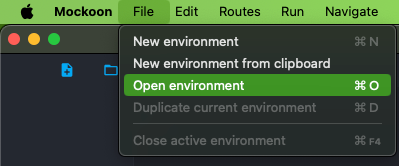
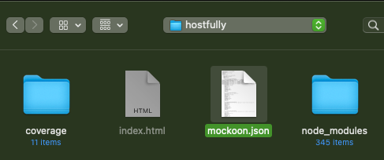
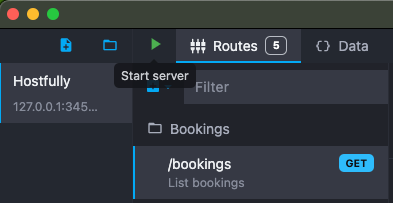
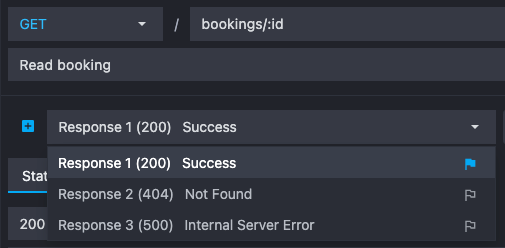
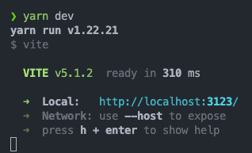

## Table of Contents

- [Requirements](#requirements)
- [Installation](#installation)
- [Mockoon](#mockoon)
- [Running](#running)

### Requirements

- Make sure to use at least **Node 18** and **Yarn 1.22.1** before proceeding
- Download and install [Mockoon](https://mockoon.com) in order to run our local mock API server

### Installation

1. Clone this project in your machine

```bash
git clone https://github.com/samuelpietra/hostfully.git
```

2. Now point your terminal to project's root

```bash
cd hostfully
```

3. Create an `.env.local` file based on `.env.example`

```bash
cp .env.example .env.local
```

4. Install project's dependencies

```bash
yarn install
```

### Mockoon

1. Open recently installed Mockoon software
2. Open existing environment (`ctrl + O` or `cmd + O`)



3. Choose `mockoon.json` file at project's root



4. Start the server (_at `localhost:3456` or available port)_



5. Feel free to explore different responses for each route



### Running

1. Make sure you follow the steps above
2. Start Mockoon server _(as learned on [this](#mockoon) step)_
3. Start project's server _(at `localhost:3123` or available port)_

```bash
yarn dev
```


